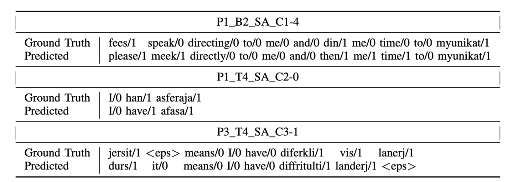

# Introduction
We present a novel E2E approach for automatic paraphasia detection. The model uses a seq2seq architecture nad has two separate heads for ASR and paraphasia detection output. We show that optimizing for both ASR and paraphasia detection objectives via multitask learning yields an optimal model for word-level and utterance-level paraphasia detection. For more details, please refer to our [paper](https://arxiv.org/abs/2312.10518).

# Example Output
Some examples from the proposed model. Model outputs both recognized speech and a binary class label indicating either a paraphasia (1) or not (0).

# Setup
This repo is built with the **[SpeechBrain Toolkit](https://github.com/speechbrain/speechbrain)** , please refer to their repo for download and installation first.

# Instructions
##  Seq2seq Paraphasia Detection Model:
1. Edit the yaml config file `AphasiaBank/hparams/Scripts/seq2seq.yaml`
2. Run using `python SB_run_experiment.py AphasiaBank/hparams/Scripts/seq2seq.yaml`

##  ASR-only Models:
1. Check out the yaml files in `AphasiaBank/hparams/ASR`
2. run using the scripts in `AphasiaBank/ASR`

# UNDER CONSTRUCTION
More details to come...

